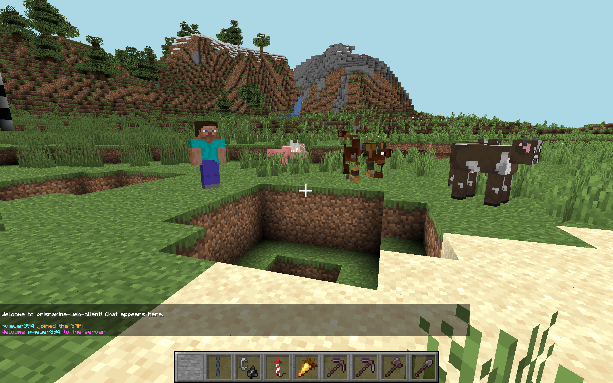

# prismarine-web-client
[](http://npmjs.com/package/prismarine-web-client)
[](https://github.com/PrismarineJS/prismarine-web-client/actions?query=workflow%3A%22CI%22)
[](https://discord.gg/GsEFRM8)
[](https://gitpod.io/#https://github.com/PrismarineJS/prismarine-web-client)

| 🇺🇸 [English](README.md) | 🇷🇺 [Russian](README_RU.md)  | 🇵🇹 [Portuguese](README_PT.md) | 🇨🇳 [简体中文](README_zh_CN.md) |
| ----------------------- | -------------------------- | ---------------------------- | ------------------------------- |

一个能在网页上运行的 Minecraft 客户端. **在线演示 https://prismarinejs.github.io/prismarine-web-client/**


## 它是如何工作的
prismarine-web-client 在浏览器中运行 mineflayer 和 prismarine-viewer，它通过 WebSocket 连接到代理
它将 WebSocket 连接转换为 TCP 以连接到普通的 Minecraft 服务器。prismarine-web-client 基于：
* [prismarine-viewer](https://github.com/PrismarineJS/prismarine-viewer) 用于世界渲染
* [mineflayer](https://github.com/PrismarineJS/mineflayer) 用于高级 Minecraft 客户端 API

如果您想了解更多它的工作原理并做出贡献，请查看这些 Modules！

## 屏幕截图


## 在线演示
在您的浏览器中打开链接，无需安装：
https://prismarinejs.github.io/prismarine-web-client/

*在桌面端的 Chrome & Firefox 上进行了测试。*

## 使用
如果想要自己托管，请在终端内运行下列命令：
```bash
$ npm install -g prismarine-web-client
$ prismarine-web-client
``` 
最后，在浏览器中打开 `http://localhost:8080`。

## 功能
* 显示生物和玩家
* 显示方块 
* 移动（您可以移动，而且也能看到其他实体移动）
* 放置和破坏方块

## 开发路线
* 容器 (例如背包，箱子)
* 声音
* 更多的互动功能 (例如攻击实体)
* 渲染功能 (例如昼夜循环，雾)

## 开发

如果您想要进行贡献/更改，您需要以不同的方式安装它。

首先，Clone 这个 Repo。

然后，切换到该 Repo 的目录。例如：
```bash
$ cd ~/prismarine-web-client/
```

最后运行：

```bash
$ npm install
$ npm start
```

这将在开发模式下启动express和webpack；每当您保存文件时，将重新进行构建（需要 5 秒），

您可以刷新页面以获取新内容。

在浏览器中打开 http://localhost:8080 。

您可能想在IDE中禁用自动保存，以避免不断重新构建；请参阅
https://webpack.js.org/guides/development/#adjusting-your-text-editor 。

要检查生产构建（构建需要 1 分钟），您可以运行`npm run build-start`。

如果有兴趣做出贡献，可以前往https://github.com/PrismarineJS/prismarine-web-client/projects 。

这些变量在全局中
``window`` 
调试对象：
* ``bot``
* ``viewer``
* ``mcData``
* ``worldView``
* ``Vec3``
* ``pathfinder``
* ``debugMenu``

### 在调试菜单中添加内容

debugMenu.customEntries['myKey'] = 'myValue'
delete debugMenu.customEntries['myKey']

### 一些调试示例

在Chrome DevTools 中：

* `bot.chat('test')` 允许你使用聊天
* `bot.chat(JSON.stringify(Object.values(bot.players).map(({username, ping}) => ({username, ping}))))` 显示每个人的ping值
* `window.bot.entity.position.y += 5` 跳跃
* `bot.chat(JSON.stringify(bot.findBlock({matching:(block) => block.name==='diamond_ore', maxDistance:256}).position))` 找到钻石块的位置
* `bot.physics.stepHeight = 2` 允许你在方块上跳跃的高度
* `bot.physics.sprintSpeed = 5` 走的更快
* `bot.loadPlugin(pathfinder.pathfinder)` then `bot.pathfinder.goto(new pathfinder.goals.GoalXZ(100, 100))` 传送至坐标 100, 100 处

有关更多调试想法，请参阅[mineflayer](https://github.com/PrismarineJS/mineflayer) 文档。
